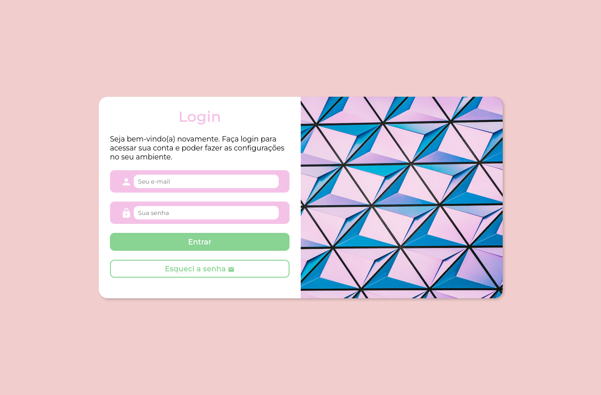
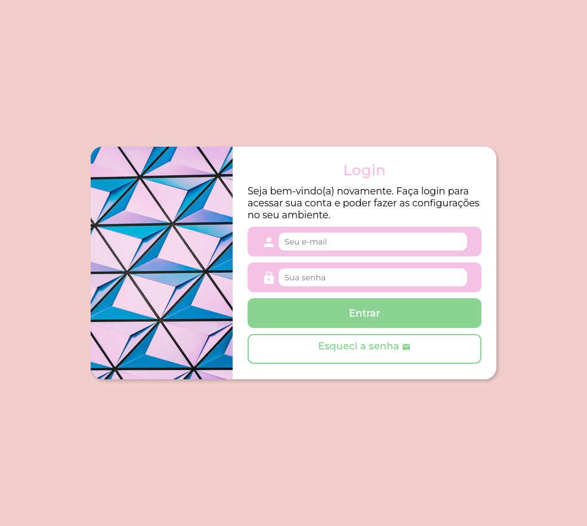
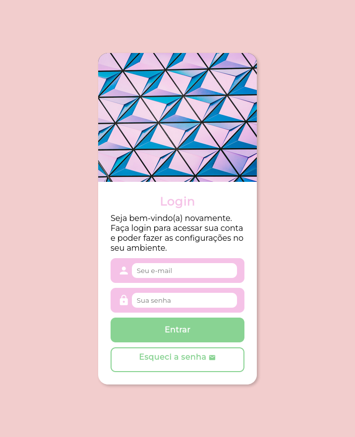

# projeto-login

Projeto tela de login desenvolvido originalmente pelo <a href="https://cursoemvideo.com">Curso em vídeo</a> e "remasterizado" por <a href="https://github.com/murilomonte">mim</a> com algumas cores mais pastéis e outras leves escolhas de design.

## Demonstração

Desktop

Tablet

Mobile

 

## Execução

<a href="https://murilomonte.github.io/projeto-login/" style="background-color: #f5c2e7; color: black; padding: 5px; border-radius: 5px; text-decoration: none;">Execute o projeto aqui</a>

